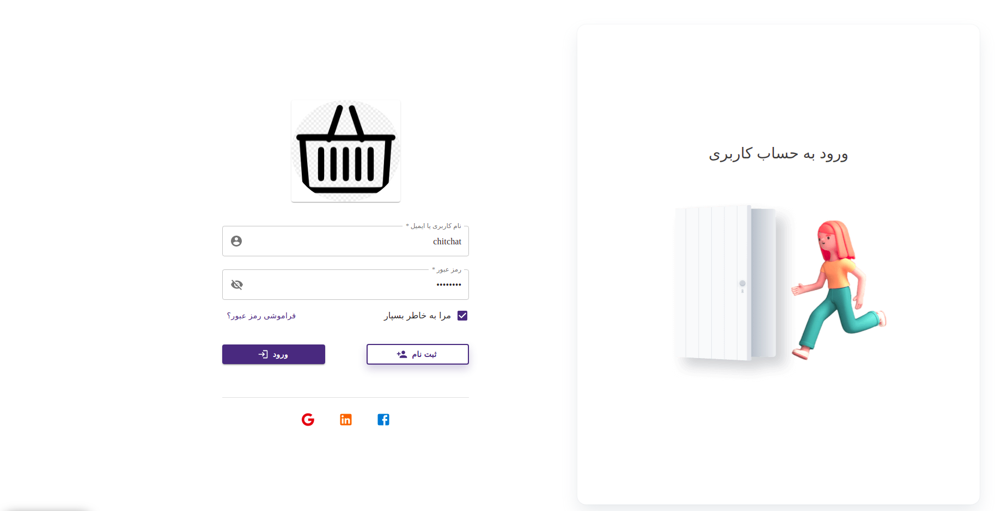
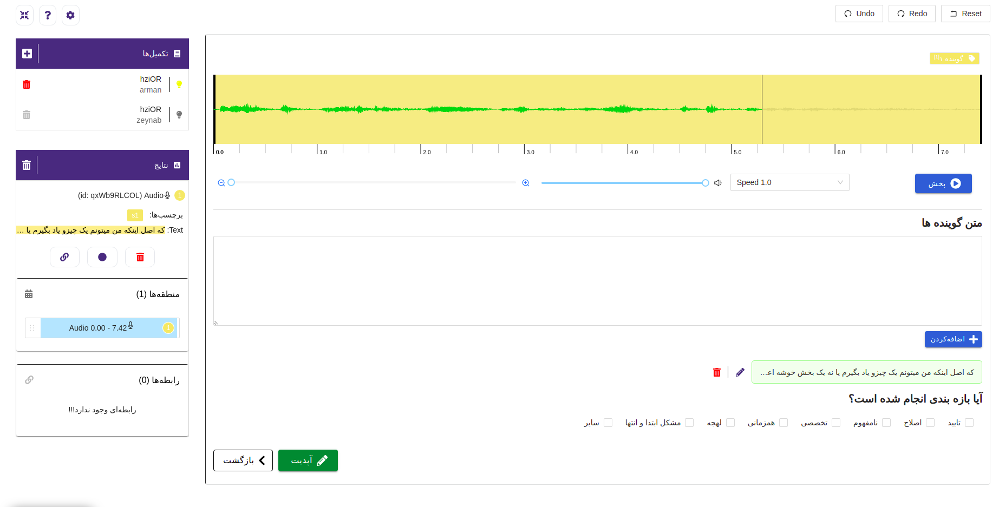
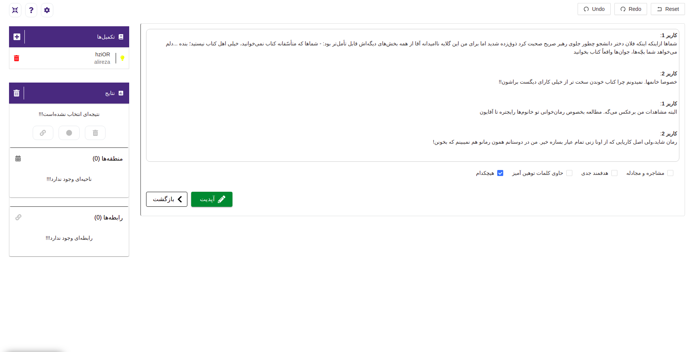
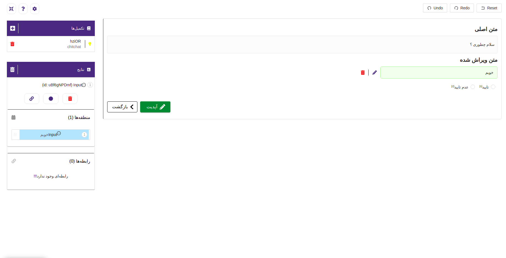
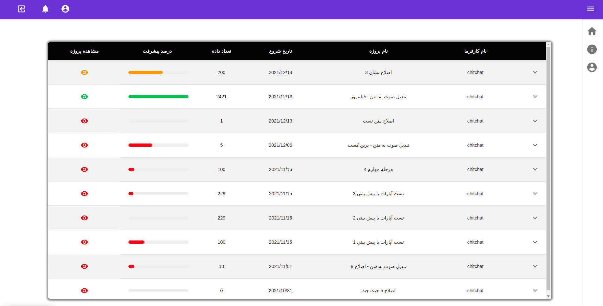

# SABAD
 


## Description
SABAD is a labeling system that has been implemented with the help of [label-studio](https://labelstud.io/) and the work of producing labeled data for various types of artificial intelligence models can be done with it.

# Getting Started
## Executing
### Docker
```bash
  sudo docker-compose up
```
### yarn
```bash
  yarn install
  yarn start
```
## Demo







## Used By
This project is used by the following companies:
- [](https://armansoft.ir/)

## Authors

- [Hamidreza Azarbad](https://www.github.com/hamidreza7799)